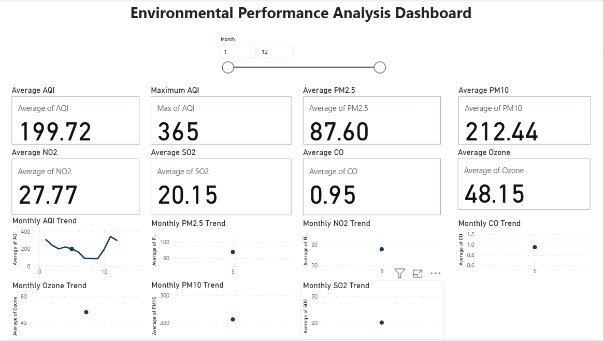

# 🌍 Environmental Performance Analysis Dashboard

## 📌 Project Overview

The Environmental Performance Analysis Dashboard is an interactive Power BI dashboard designed to analyze air quality data and monitor environmental pollution trends. The dashboard provides key performance indicators (KPIs) and monthly trend analysis for major pollutants.

This project demonstrates data cleaning, data modeling, KPI creation, and dashboard development using Microsoft Power BI.

---

## 🎯 Objectives

* Analyze air quality data.
* Monitor monthly pollution trends.
* Track important environmental KPIs.
* Create an interactive dashboard for data visualization.

---

## 🛠️ Tools & Technologies

* Microsoft Power BI
* Microsoft Excel
* CSV Dataset
* Git & GitHub

---

## 📂 Project Structure

```text
Environmental-Performance-Analysis-Dashboard/
│
├── Dataset/
│   ├── final_dataset.csv
│   └── Notes/
│
├── Images/
│   └── dashboard.png
│
├── PowerBI/
│   └── environmental_performance_dashboard.pbix
│
└── README.md
```

---

## 📊 Dashboard Features

### KPI Cards

* Average AQI
* Maximum AQI
* Average PM2.5
* Average PM10
* Average NO2
* Average SO2
* Average CO
* Average Ozone

### Interactive Filter

* Month Slicer

### Trend Analysis

* Monthly AQI Trend
* Monthly PM2.5 Trend
* Monthly PM10 Trend
* Monthly NO2 Trend
* Monthly SO2 Trend
* Monthly CO Trend
* Monthly Ozone Trend

---

## 📷 Dashboard Preview

> Place the dashboard screenshot inside the **Images** folder with the name **dashboard.png**.

```markdown

```

---

## 📈 Key Insights

* AQI changes across different months.
* PM2.5 and PM10 show seasonal variation.
* NO2, SO2, CO, and Ozone trends can be compared monthly.
* KPI cards provide a quick summary of environmental performance.

---

## 🚀 Future Improvements

* Add Year and Date filters.
* Add city-wise comparison.
* Include forecasting.
* Publish the dashboard to the Power BI Service.

---

## 👩‍💻 Author

**Rachna **

Aspiring Cloud Engineer | Learning Data Analytics & Power BI


